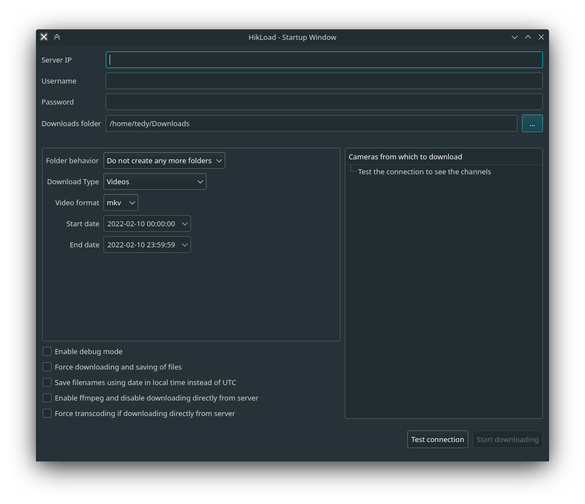
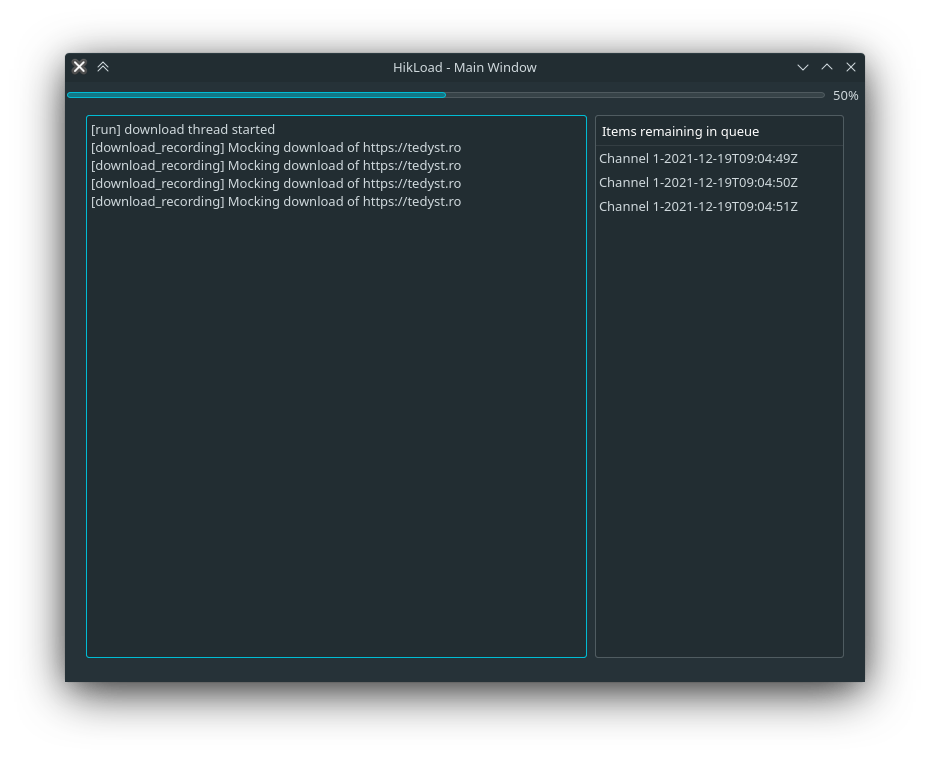

# HikLoad

A collection of short Python scripts that utilize the ISAPI specification for Hikvision DVR/NVRs/Cameras.

## Using the UI

If you want to use the new interface written in Qt, you can use the command `hikload-qt` after installing using one of the recommended methods (only pip and source). 





## Using the terminal

To use your own DVR it is usually only needed to change the arguments for the script. The first parameter is the IP, the second one is the username and the third is the password. Here are all of the possible parameters:

```
usage: hikload [-h] [--server SERVER] [--username USERNAME] [--password PASSWORD] [--starttime STARTTIME] [--endtime ENDTIME]
               [--folders {onepercamera,oneperday,onepermonth,oneperyear}] [--debug | --no-debug] [--videoformat {mkv,mp4,avi}] [--downloads DOWNLOADS] [--frames FRAMES]
               [--force | --no-force] [--skipseconds SKIPSECONDS] [--seconds SECONDS] [--days DAYS] [--skipdownload | --no-skipdownload] [--allrecordings | --no-allrecordings]
               [--cameras CAMERAS] [--localtimefilenames | --no-localtimefilenames] [--yesterday | --no-yesterday] [--ffmpeg | --no-ffmpeg]
               [--forcetranscoding | --no-forcetranscoding] [--photos | --no-photos] [--mock | --no-mock] [--ui | --no-ui]

Download Recordings from a HikVision server, from a range interval

options:
  -h, --help            show this help message and exit
  --server SERVER       the hikvision server's address
  --username USERNAME   the username
  --password PASSWORD   the password
  --starttime STARTTIME
                        the start time in ISO format (default: today at 00:00:00, local time)
  --endtime ENDTIME     the start time in ISO format (default: today at 23:59:59, local time)
  --folders {onepercamera,oneperday,onepermonth,oneperyear}
                        create a separate folder per camera/duration (default: disabled)
  --debug, --no-debug   enable debug mode (default: false)
  --videoformat {mkv,mp4,avi}
                        specify video format (default: mkv)
  --downloads DOWNLOADS
                        the downloads folder (default: "Downloads")
  --frames FRAMES       save a frame for every X frames in the video (default: false)
  --force, --no-force   force saving of files (default: false)
  --skipseconds SKIPSECONDS
                        skip first X seconds for each video (default: 0)
  --seconds SECONDS     save only X seconds for each video (default: inf)
  --days DAYS           download videos for the last X days (ignores --endtime and --starttime)
  --skipdownload, --no-skipdownload
                        do not download anything
  --allrecordings, --no-allrecordings
                        download all recordings saved
  --cameras CAMERAS     camera IDs to search (example: --cameras=201,301)
  --localtimefilenames, --no-localtimefilenames
                        save filenames using date in local time instead of UTC
  --yesterday, --no-yesterday
                        download yesterday's videos
  --ffmpeg, --no-ffmpeg
                        enable ffmpeg and disable downloading directly from server
  --forcetranscoding, --no-forcetranscoding
                        force transcoding if downloading directly from server
  --photos, --no-photos
                        enable experimental downloading of saved photos
  --mock, --no-mock     enable mock mode WARNING! This will not download anything from the server
  --ui, --no-ui         enable UI interface WARNING! Requires Qt5 to be installed (default: False)
```

The DVR/NVR needs to have ISAPI and RTSP enabled in System/Security and H264+ disabled for every camera.

## Installing and running the script

You can install the script from [PyPi](https://pypi.org/project/hikload/), run the script directly from the source, or use the Docker image:

```bash
docker pull ghcr.io/tedyst/hikload
docker run -v $(pwd)/Downloads:/app/Downloads ghcr.io/tedyst/hikload --server 192.168.10.239 --user admin --password password
```

If you decide to use the PyPi package, there will be a command called `hikload` in your PATH, and also a program named `hikload-qt` for the UI version:
```bash
pip install hikload
hikload -h
```

To run the script from source, you can use this command from the root directory of the project:
```bash
python setup.py install
hikload -h
```
After this command, you will have installed `hikload` and `hikload-qt` in your PATH.

If you want to use the default arguments, you can specify only the required arguments:

```bash
hikload --server 192.168.10.239 --user username --password password
```

For more advanced users, you can specify optional arguments like the start and end time for the video search:

```bash
hikload --server 192.168.10.239 --user username --password password --starttime 2021-09-19T03:00:00+03:00 --endtime 2021-09-20T04:00:00+00:00
```

Or just specify the cameras that you want to search(be sure to use the HikVision format - 101 for first camera, 201 for the second one...):

```bash
hikload --server 192.168.10.239 --user username --password password --cameras=201,301
```

## Installing Dependencies

Due to [common problems](https://github.com/kkroening/ffmpeg-python/issues/174#issuecomment-561546739) found while installing the dependencies needed by this project, it is recommended to use a python virtualenv. Here is how to setup one:

```bash
pip install pipenv
pipenv install --dev
pipenv shell
```

And everytime you restart the terminal and want to use the virtualenv, you need to run these commands:

```bash
pipenv shell
```